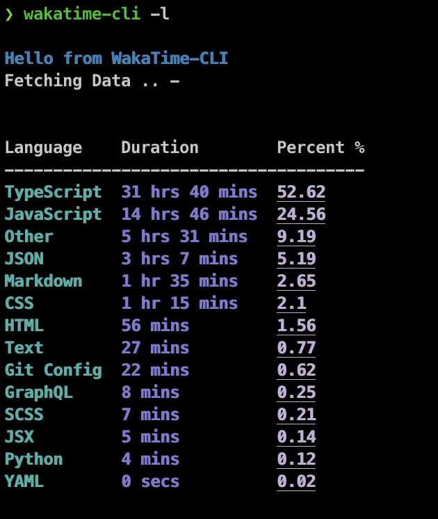
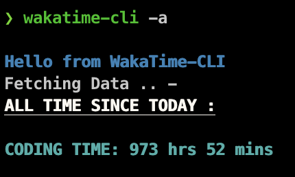

<br />
<p align="center">
    
  </a>
</p>

## 🚀 Getting Started

### 👨🏽‍💻 Prerequisites

This is an example of how to list things you need to use the software and how to install them.

- npm
  ```sh
  npm install npm@latest -g
  ```
- Wakatime Account

### 🕹 Installation

1. Get your Wakatime API Key from [Here](https://wakatime.com/settings/account)

2. Install Via `npm`
   ```sh
   npm install -g @deepcodes/wakatime-cli
   ```

## 🧬 Usage

Options:

```sh
❯ wakatime-cli -h
Usage: wakatime-cli [options]

Options:
  -v, --vers           output the current version
  -k, --apiKey <type>  Enter Your Wakatime APIKEY
  -r, --remove         Remove Your saved API_KEY
  -l, --language       Coding Data of Languages in Last 7days
  -a, --all            All Time Since Today
  -h, --help           display help for command
```

Copy Your `Wakatime APIKEY`:

This will Save your APIKEY.

```sh
 wakatime-cli -k <API_KEY>
```

If it's Saved it should show this:


Now that it's Saved You can get your Wakatime Stats Rightaway🚀

- Gives Stats of Language of last 7days

```sh
wakatime-cli -l
```



- Gives Cumulative Coding Time

```sh
wakatime-cli -a
```

More Feature Will be Added Soon.
If you need some Feel Free to Open an Issue.


## 🏗Contributing

Contributions are what make the open source community such an amazing place to be learn, inspire, and create. Any contributions you make are **greatly appreciated**.

1. Fork the Project
2. Create your Feature Branch (`git checkout -b feature/AmazingFeature`)
3. Commit your Changes (`git commit -m 'Add some AmazingFeature'`)
4. Push to the Branch (`git push origin feature/AmazingFeature`)
5. Open a Pull Request

## 📚 License

Distributed under the MIT License. See `LICENSE` for more information.

## 😇 Contact

Twitter - [@DeepankarBhade](https://twitter.com/DeepankarBhade)

<!-- ACKNOWLEDGEMENTS -->

## 📖 Acknowledgements

- [Wakatime](https://wakatime.com/dashboard)
- [Wakatime API](https://wakatime.com/developers)
